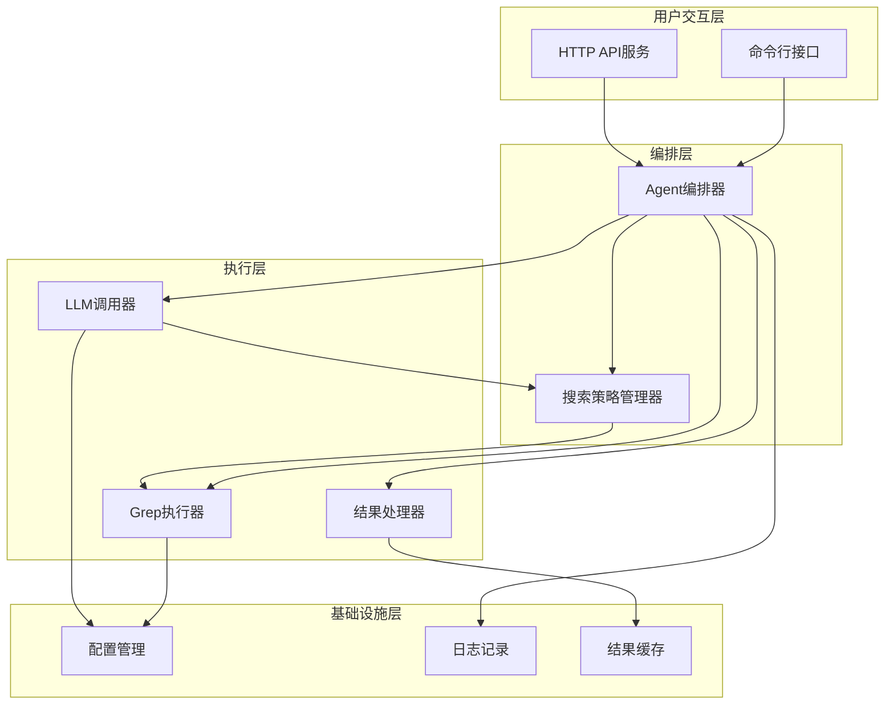
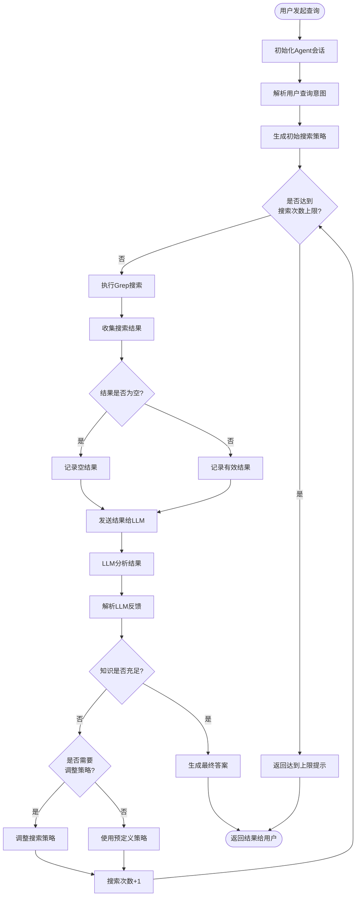
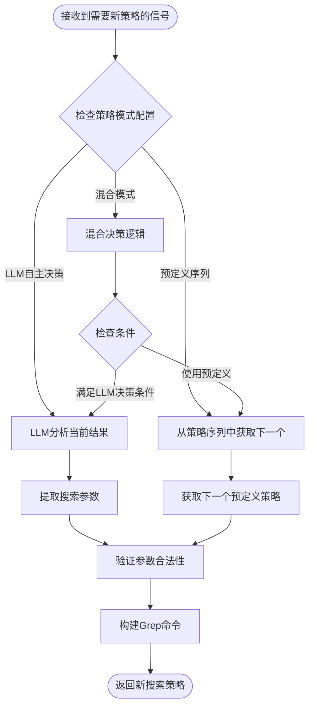
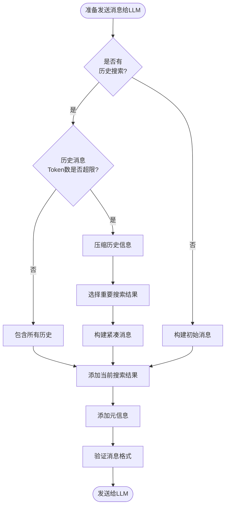
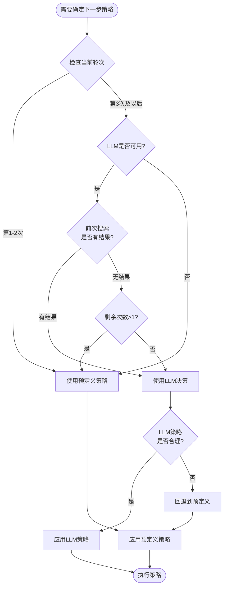
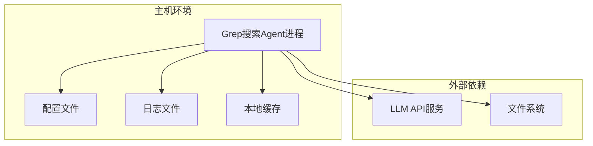
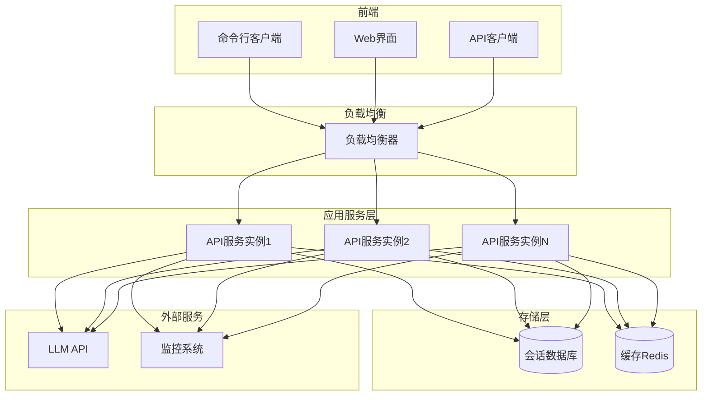
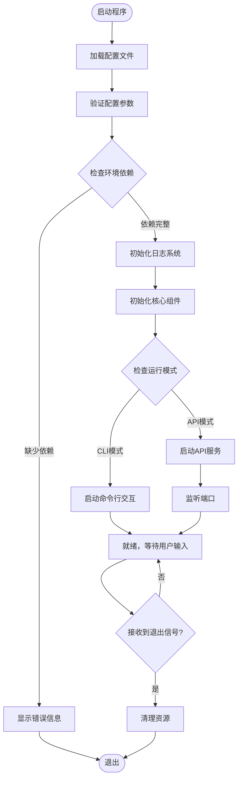

# Grep搜索Agent系统设计

## 1. 系统概述

### 1.1 系统目标
设计并实现一个智能化的grep搜索Agent系统，该系统能够通过grep命令在指定目录中搜索内容，将搜索结果提交给大语言模型进行分析，并根据LLM的反馈智能调整搜索策略，同时支持可配置的搜索次数控制。系统提供命令行交互和API服务两种使用方式。

### 1.2 核心能力
- 基于grep命令的文件内容搜索
- 与大语言模型集成，智能分析搜索结果
- 自适应搜索策略调整机制
- 可配置的搜索次数限制
- 支持命令行交互和API服务双模式
- 搜索范围可配置（指定目录或全局）

## 2. 系统架构

### 2.1 架构层次

系统采用分层架构，自下而上分为以下层次：

### 2.2 核心组件说明

| 组件名称 | 职责描述 | 关键功能 |
|---------|---------|---------|
| 命令行接口 | 提供交互式CLI工具 | 接收用户查询，展示搜索过程和结果 |
| HTTP API服务 | 提供RESTful API | 支持外部系统集成，异步搜索任务 |
| Agent编排器 | 核心控制逻辑 | 协调搜索流程，管理搜索轮次，判断终止条件 |
| 搜索策略管理器 | 搜索策略决策 | 根据LLM反馈或预定义规则生成搜索策略 |
| Grep执行器 | 执行grep命令 | 构造grep命令参数，执行搜索，解析输出 |
| LLM调用器 | 与大语言模型交互 | 发送搜索结果，接收分析反馈 |
| 结果处理器 | 处理和格式化结果 | 聚合搜索结果，去重，格式化输出 |
| 配置管理 | 系统配置管理 | 加载配置，验证参数，提供配置访问接口 |
| 日志记录 | 记录系统运行日志 | 记录搜索过程，异常信息，性能指标 |
| 结果缓存 | 缓存搜索结果 | 避免重复搜索，提升响应速度 |

## 3. 核心流程设计

### 3.1 主搜索流程

### 3.2 搜索策略决策流程

系统支持混合模式的搜索策略决策：

### 3.3 搜索策略类型

系统支持多种搜索策略的组合和调整：

| 策略类型 | 说明 | 使用场景 | Grep参数特点 |
|---------|------|---------|-------------|
| 精确匹配 | 完全匹配关键词 | 初始搜索，已知准确术语 | 使用固定字符串，-F参数 |
| 模糊匹配 | 正则表达式匹配 | 关键词不确定，需要扩展搜索 | 使用正则表达式，-E参数 |
| 上下文扩展 | 显示匹配行的上下文 | 需要理解代码或文本语境 | -A -B -C参数指定上下文行数 |
| 文件类型过滤 | 限定搜索特定类型文件 | 缩小搜索范围，提高精确度 | --include参数指定文件模式 |
| 大小写不敏感 | 忽略大小写差异 | 术语大小写不确定 | -i参数 |
| 递归深度控制 | 限制目录递归深度 | 避免搜索过深，提升速度 | --max-depth参数（需配合find） |
| 排除规则 | 排除特定目录或文件 | 避免搜索无关内容 | --exclude参数 |

## 4. 数据模型设计

### 4.1 核心数据结构

#### 4.1.1 搜索会话

| 字段名称 | 数据类型 | 说明 | 约束 |
|---------|---------|------|------|
| session_id | 字符串 | 会话唯一标识 | 必填，UUID格式 |
| user_query | 字符串 | 用户原始查询 | 必填，最长1000字符 |
| search_scope | 字符串 | 搜索范围路径 | 必填，有效目录路径 |
| max_iterations | 整数 | 最大搜索次数 | 必填，默认5，范围1-20 |
| current_iteration | 整数 | 当前搜索次数 | 自动维护，初始值0 |
| status | 枚举 | 会话状态 | INIT/RUNNING/COMPLETED/FAILED |
| created_at | 时间戳 | 创建时间 | 自动生成 |
| updated_at | 时间戳 | 更新时间 | 自动更新 |
| final_answer | 字符串 | 最终答案 | 可选，任务完成后填充 |
| search_history | 列表 | 搜索历史记录 | 存储每次搜索的详细信息 |

#### 4.1.2 搜索记录

| 字段名称 | 数据类型 | 说明 | 约束 |
|---------|---------|------|------|
| iteration_num | 整数 | 搜索轮次编号 | 必填，从1开始 |
| strategy_type | 枚举 | 策略类型 | EXACT/FUZZY/CONTEXT/FILTERED等 |
| grep_command | 字符串 | 实际执行的grep命令 | 必填 |
| search_pattern | 字符串 | 搜索模式或关键词 | 必填 |
| search_options | 对象 | grep选项参数 | 包含各种参数设置 |
| execution_time | 浮点数 | 执行耗时（秒） | 自动记录 |
| result_count | 整数 | 匹配结果数量 | 自动统计 |
| result_preview | 字符串 | 结果预览 | 最多保存前100行 |
| full_result | 字符串 | 完整结果 | 可选，根据配置决定是否保存 |
| llm_feedback | 对象 | LLM分析反馈 | 包含充足性判断和建议 |

#### 4.1.3 LLM交互消息

| 字段名称 | 数据类型 | 说明 | 约束 |
|---------|---------|------|------|
| message_id | 字符串 | 消息唯一标识 | UUID格式 |
| session_id | 字符串 | 关联的会话ID | 外键关联 |
| iteration_num | 整数 | 对应的搜索轮次 | 关联搜索记录 |
| role | 枚举 | 消息角色 | USER/ASSISTANT/SYSTEM |
| content | 字符串 | 消息内容 | 必填 |
| timestamp | 时间戳 | 消息时间 | 自动生成 |
| token_count | 整数 | Token数量 | 用于成本统计 |

#### 4.1.4 搜索策略配置

| 字段名称 | 数据类型 | 说明 | 约束 |
|---------|---------|------|------|
| strategy_name | 字符串 | 策略名称 | 必填，唯一标识 |
| strategy_mode | 枚举 | 策略模式 | LLM_DRIVEN/PREDEFINED/HYBRID |
| predefined_sequence | 列表 | 预定义策略序列 | 策略类型的有序列表 |
| hybrid_rules | 对象 | 混合模式规则 | 条件判断规则集 |
| grep_base_options | 对象 | grep基础选项 | 默认的grep参数配置 |
| file_include_patterns | 列表 | 包含的文件模式 | glob模式列表 |
| file_exclude_patterns | 列表 | 排除的文件模式 | glob模式列表 |
| max_result_size | 整数 | 最大结果大小（字节） | 防止结果过大 |

### 4.2 配置参数模型

#### 4.2.1 系统配置

| 配置项 | 数据类型 | 默认值 | 说明 |
|-------|---------|--------|------|
| default_max_iterations | 整数 | 5 | 默认最大搜索次数 |
| default_search_scope | 字符串 | ./src | 默认搜索范围 |
| enable_cache | 布尔 | true | 是否启用结果缓存 |
| cache_ttl | 整数 | 3600 | 缓存过期时间（秒） |
| log_level | 字符串 | INFO | 日志级别 |
| result_preview_lines | 整数 | 100 | 结果预览行数 |
| max_result_size_mb | 整数 | 10 | 单次搜索最大结果大小 |

#### 4.2.2 LLM配置

| 配置项 | 数据类型 | 默认值 | 说明 |
|-------|---------|--------|------|
| llm_provider | 字符串 | openai | LLM提供商 |
| api_endpoint | 字符串 | - | API端点URL |
| api_key | 字符串 | - | API密钥 |
| model_name | 字符串 | gpt-4 | 使用的模型名称 |
| max_tokens | 整数 | 2000 | 最大生成token数 |
| temperature | 浮点数 | 0.7 | 生成温度参数 |
| timeout | 整数 | 30 | 请求超时时间（秒） |
| retry_times | 整数 | 3 | 失败重试次数 |

#### 4.2.3 API服务配置

| 配置项 | 数据类型 | 默认值 | 说明 |
|-------|---------|--------|------|
| host | 字符串 | 0.0.0.0 | 监听地址 |
| port | 整数 | 8000 | 监听端口 |
| enable_cors | 布尔 | true | 是否启用CORS |
| max_concurrent_sessions | 整数 | 10 | 最大并发会话数 |
| session_timeout | 整数 | 1800 | 会话超时时间（秒） |

## 5. 接口设计

### 5.1 命令行接口

#### 5.1.1 交互模式命令

| 命令 | 参数 | 说明 | 示例 |
|-----|------|------|------|
| search | query, --scope, --max-iter | 发起搜索查询 | search "find user authentication" --scope ./src --max-iter 5 |
| config | set/get/list | 配置管理 | config set default_max_iterations 10 |
| history | --limit | 查看搜索历史 | history --limit 10 |
| session | list/show/clear | 会话管理 | session show <session_id> |
| help | [command] | 显示帮助信息 | help search |
| exit | - | 退出程序 | exit |

#### 5.1.2 启动参数

| 参数 | 简写 | 类型 | 说明 | 默认值 |
|-----|------|------|------|--------|
| --mode | -m | 字符串 | 运行模式：cli/api | cli |
| --config | -c | 字符串 | 配置文件路径 | ./config.yaml |
| --verbose | -v | 布尔 | 详细输出模式 | false |
| --log-file | -l | 字符串 | 日志文件路径 | ./logs/agent.log |

### 5.2 HTTP API接口

#### 5.2.1 创建搜索会话

**请求**
- 路径：POST /api/v1/sessions
- 内容类型：application/json

请求体结构：

| 字段 | 类型 | 必填 | 说明 |
|-----|------|------|------|
| query | 字符串 | 是 | 用户查询内容 |
| search_scope | 字符串 | 否 | 搜索范围，默认使用配置值 |
| max_iterations | 整数 | 否 | 最大搜索次数，默认5 |
| strategy_mode | 字符串 | 否 | 策略模式：llm/predefined/hybrid |
| options | 对象 | 否 | 其他可选配置 |

**响应**
- 状态码：201 Created
- 内容类型：application/json

响应体结构：

| 字段 | 类型 | 说明 |
|-----|------|------|
| session_id | 字符串 | 会话唯一标识 |
| status | 字符串 | 会话状态 |
| created_at | 字符串 | 创建时间（ISO 8601格式） |
| message | 字符串 | 提示信息 |

#### 5.2.2 获取会话状态

**请求**
- 路径：GET /api/v1/sessions/{session_id}
- 内容类型：application/json

**响应**
- 状态码：200 OK
- 内容类型：application/json

响应体结构：

| 字段 | 类型 | 说明 |
|-----|------|------|
| session_id | 字符串 | 会话ID |
| status | 字符串 | 当前状态 |
| current_iteration | 整数 | 当前搜索次数 |
| max_iterations | 整数 | 最大搜索次数 |
| search_history | 列表 | 搜索历史 |
| final_answer | 字符串 | 最终答案（如果已完成） |
| progress | 浮点数 | 进度百分比 |

#### 5.2.3 获取会话结果

**请求**
- 路径：GET /api/v1/sessions/{session_id}/result
- 内容类型：application/json

**响应**
- 状态码：200 OK
- 内容类型：application/json

响应体结构：

| 字段 | 类型 | 说明 |
|-----|------|------|
| session_id | 字符串 | 会话ID |
| status | 字符串 | 会话状态 |
| answer | 字符串 | 最终答案 |
| total_iterations | 整数 | 总搜索次数 |
| total_matches | 整数 | 总匹配数量 |
| execution_time | 浮点数 | 总执行时间（秒） |
| search_details | 列表 | 每次搜索的详细信息 |

#### 5.2.4 取消会话

**请求**
- 路径：DELETE /api/v1/sessions/{session_id}
- 内容类型：application/json

**响应**
- 状态码：200 OK
- 内容类型：application/json

响应体结构：

| 字段 | 类型 | 说明 |
|-----|------|------|
| session_id | 字符串 | 会话ID |
| message | 字符串 | 操作结果提示 |

#### 5.2.5 列出所有会话

**请求**
- 路径：GET /api/v1/sessions
- 查询参数：
  - page: 页码（默认1）
  - page_size: 每页数量（默认20）
  - status: 过滤状态（可选）

**响应**
- 状态码：200 OK
- 内容类型：application/json

响应体结构：

| 字段 | 类型 | 说明 |
|-----|------|------|
| sessions | 列表 | 会话列表 |
| total | 整数 | 总数量 |
| page | 整数 | 当前页码 |
| page_size | 整数 | 每页数量 |

#### 5.2.6 健康检查

**请求**
- 路径：GET /api/v1/health
- 内容类型：application/json

**响应**
- 状态码：200 OK
- 内容类型：application/json

响应体结构：

| 字段 | 类型 | 说明 |
|-----|------|------|
| status | 字符串 | 服务状态：healthy/unhealthy |
| version | 字符串 | 系统版本 |
| timestamp | 字符串 | 当前时间 |

## 6. LLM交互设计

### 6.1 Prompt工程策略

#### 6.1.1 系统提示词结构

系统提示词应包含以下核心要素：

| 要素 | 目的 | 内容概要 |
|-----|------|---------|
| 角色定义 | 明确LLM的角色 | 定义为代码搜索助手，专注于分析grep搜索结果 |
| 任务说明 | 阐述核心任务 | 分析搜索结果是否足够回答用户问题 |
| 判断标准 | 提供判断依据 | 明确什么情况下知识充足或不充足 |
| 输出格式 | 规范响应格式 | 要求结构化JSON格式输出 |
| 策略建议 | 指导下一步搜索 | 当知识不足时提供具体的搜索建议 |

#### 6.1.2 用户消息构造

每次向LLM发送的消息应包含：

| 信息项 | 内容 | 作用 |
|-------|------|------|
| 原始查询 | 用户的初始问题 | 保持上下文一致性 |
| 当前搜索轮次 | 第N次搜索 | 帮助LLM理解进展 |
| 搜索策略 | 本次使用的grep参数 | 说明搜索方式 |
| 搜索结果 | grep命令输出 | 核心分析对象 |
| 历史搜索摘要 | 之前的搜索尝试 | 避免重复搜索 |
| 剩余次数 | 还可以搜索几次 | 影响策略激进程度 |

#### 6.1.3 LLM响应格式

要求LLM返回结构化的JSON响应：

| 字段 | 类型 | 必填 | 说明 |
|-----|------|------|------|
| is_sufficient | 布尔 | 是 | 当前信息是否足够回答问题 |
| confidence | 浮点数 | 是 | 置信度（0-1） |
| answer | 字符串 | 条件 | 如果充足，提供答案 |
| analysis | 字符串 | 是 | 对当前结果的分析 |
| missing_info | 列表 | 条件 | 如果不充足，缺少哪些信息 |
| next_strategy | 对象 | 条件 | 建议的下一步搜索策略 |
| reason | 字符串 | 是 | 判断理由 |

#### 6.1.4 搜索策略建议格式

当LLM建议下一步搜索时，应返回：

| 字段 | 类型 | 说明 |
|-----|------|------|
| search_type | 字符串 | 策略类型（exact/fuzzy/context等） |
| keywords | 列表 | 建议搜索的关键词 |
| file_patterns | 列表 | 建议的文件类型过滤 |
| context_lines | 整数 | 建议的上下文行数 |
| case_sensitive | 布尔 | 是否大小写敏感 |
| explanation | 字符串 | 为什么建议这个策略 |

### 6.2 LLM交互流程优化

#### 6.2.1 上下文管理策略

#### 6.2.2 错误处理与重试

当LLM调用失败时的处理策略：

| 错误类型 | 处理策略 | 重试条件 |
|---------|---------|---------|
| 网络超时 | 立即重试 | 最多3次，指数退避 |
| API限流 | 等待后重试 | 根据Retry-After头 |
| 响应格式错误 | 解析修复 | 尝试宽松解析，失败则重新请求 |
| Token超限 | 压缩上下文 | 删减历史信息后重试 |
| 认证失败 | 终止会话 | 不重试，返回错误给用户 |
| 模型错误 | 记录并继续 | 使用预定义策略继续搜索 |

### 6.3 混合策略模式决策规则

混合模式下的决策逻辑：

## 7. 预定义搜索策略序列

### 7.1 默认策略序列

当使用预定义模式或混合模式的预定义部分时，按以下顺序尝试搜索策略：

| 序号 | 策略名称 | 策略描述 | Grep选项说明 |
|-----|---------|---------|-------------|
| 1 | 精确匹配 | 使用用户提供的关键词进行精确匹配 | 固定字符串搜索，递归，行号显示 |
| 2 | 大小写不敏感 | 忽略大小写重新搜索 | 添加-i参数 |
| 3 | 扩展上下文 | 显示匹配行的前后3行 | 添加-C 3参数 |
| 4 | 模糊匹配 | 使用正则表达式放宽匹配条件 | 使用-E参数，关键词词根匹配 |
| 5 | 全局广搜 | 移除文件类型限制，扩大搜索范围 | 移除--include限制，增加递归深度 |

### 7.2 针对不同场景的策略序列

#### 7.2.1 代码搜索场景

| 序号 | 策略 | 说明 |
|-----|------|------|
| 1 | 函数定义搜索 | 搜索函数定义模式，限定代码文件 |
| 2 | 函数调用搜索 | 搜索函数调用位置 |
| 3 | 注释搜索 | 搜索相关注释说明 |
| 4 | 变量引用搜索 | 查找变量使用位置 |

#### 7.2.2 配置搜索场景

| 序号 | 策略 | 说明 |
|-----|------|------|
| 1 | 配置键精确匹配 | 在配置文件中搜索配置项 |
| 2 | 配置文件遍历 | 检查所有配置文件 |
| 3 | 默认值搜索 | 查找默认配置定义 |

#### 7.2.3 文档搜索场景

| 序号 | 策略 | 说明 |
|-----|------|------|
| 1 | 标题搜索 | 搜索文档标题和章节 |
| 2 | 全文搜索 | 在文档正文中搜索 |
| 3 | 示例代码搜索 | 查找文档中的代码示例 |

## 8. 异常处理与边界情况

### 8.1 异常场景分类

| 异常类型 | 触发条件 | 处理策略 | 用户反馈 |
|---------|---------|---------|---------|
| 搜索路径不存在 | 指定的搜索目录无效 | 提示错误，要求重新输入 | 明确告知路径问题 |
| 权限不足 | 无法访问某些目录或文件 | 跳过无权限目录，继续搜索 | 警告信息，列出跳过的路径 |
| Grep命令失败 | Grep执行返回错误 | 记录错误，尝试降级策略 | 提示搜索遇到问题 |
| LLM调用失败 | API调用超时或错误 | 重试机制，超限后使用预定义策略 | 说明正在使用备用方案 |
| 结果过大 | 匹配结果超过限制 | 截断结果，建议缩小范围 | 提示结果过多，建议优化查询 |
| 超时 | 单次搜索执行时间过长 | 终止当前搜索，记录部分结果 | 提示超时，询问是否继续 |
| 达到最大轮次 | 搜索次数用尽仍未得到答案 | 返回已收集的所有信息 | 说明已达上限，提供部分结果 |
| 无任何结果 | 所有搜索均无匹配 | 建议扩大范围或检查关键词 | 提示未找到相关内容 |
| 配置错误 | 配置文件格式错误或缺失 | 使用默认配置并警告 | 提示使用默认配置 |
| 会话过期 | API模式下会话超时 | 清理会话资源 | 返回会话过期错误 |

### 8.2 边界条件处理

#### 8.2.1 输入验证

| 验证项 | 验证规则 | 不满足时的处理 |
|-------|---------|---------------|
| 查询内容 | 非空，长度在1-1000字符 | 提示错误，要求重新输入 |
| 搜索路径 | 存在且可访问 | 检查并提示路径问题 |
| 最大轮次 | 整数，范围1-20 | 使用边界值或默认值 |
| 文件模式 | 有效的glob模式 | 忽略无效模式，使用默认 |

#### 8.2.2 资源限制

| 资源类型 | 限制策略 | 达到限制时的行为 |
|---------|---------|----------------|
| 内存使用 | 单次搜索结果不超过配置的最大值 | 截断结果，记录警告 |
| 文件数量 | 单次搜索匹配的文件数上限 | 返回前N个文件的结果 |
| 执行时间 | 单次grep执行超时时间 | 终止执行，标记为超时 |
| 并发会话 | API模式下最大并发数 | 拒绝新会话，返回繁忙状态 |
| Token使用 | LLM单次请求Token上限 | 压缩上下文或分批处理 |

### 8.3 日志与监控

#### 8.3.1 日志记录内容

| 日志级别 | 记录内容 | 用途 |
|---------|---------|------|
| DEBUG | 详细的执行过程，参数值 | 开发调试 |
| INFO | 搜索开始/结束，策略选择，结果摘要 | 运行追踪 |
| WARNING | 降级策略使用，部分失败 | 异常监控 |
| ERROR | 执行失败，异常堆栈 | 故障排查 |
| CRITICAL | 系统级故障 | 紧急告警 |

#### 8.3.2 性能指标

| 指标名称 | 计算方式 | 监控目的 |
|---------|---------|---------|
| 平均搜索耗时 | 单次grep执行时间统计 | 性能优化 |
| LLM响应时间 | API调用耗时 | 依赖服务监控 |
| 成功率 | 完成会话数/总会话数 | 服务质量 |
| 平均轮次 | 总搜索次数/完成会话数 | 策略效果评估 |
| Token消耗 | 累计Token使用量 | 成本控制 |

## 9. 扩展性设计

### 9.1 插件化架构支持

系统应支持通过插件扩展以下能力：

| 扩展点 | 说明 | 接口要求 |
|-------|------|---------|
| 搜索工具 | 支持除grep外的其他搜索工具 | 统一的搜索执行器接口 |
| LLM提供商 | 支持不同的LLM服务 | 统一的LLM调用器接口 |
| 存储后端 | 支持不同的会话存储方式 | 统一的存储访问接口 |
| 结果处理器 | 自定义结果格式化和过滤 | 结果处理器接口 |
| 策略生成器 | 自定义策略决策逻辑 | 策略生成器接口 |

### 9.2 未来功能预留

系统架构应考虑以下未来功能的扩展空间：

| 功能 | 设计考虑 | 架构影响 |
|-----|---------|---------|
| 多语言搜索 | 支持不同编程语言的语法感知搜索 | 搜索策略需要语言上下文 |
| 语义搜索 | 基于代码语义而非文本的搜索 | 引入代码解析和向量搜索 |
| 协作模式 | 多用户共享搜索会话 | 会话数据结构需支持多用户 |
| 搜索索引 | 预建索引加速搜索 | 增加索引管理模块 |
| 可视化界面 | Web前端展示搜索过程 | API需要支持实时推送 |
| 学习优化 | 根据历史优化搜索策略 | 引入策略学习和反馈机制 |

## 10. 部署与运行

### 10.1 部署架构

#### 10.1.1 单机部署

#### 10.1.2 服务化部署

### 10.2 运行环境要求

| 资源类型 | 最低配置 | 推荐配置 | 说明 |
|---------|---------|---------|------|
| 操作系统 | Linux/macOS/Windows | Linux | 需要支持grep命令 |
| Python版本 | 3.8+ | 3.10+ | 使用Python开发 |
| 内存 | 512MB | 2GB | 根据搜索范围调整 |
| 磁盘空间 | 100MB | 1GB | 用于日志和缓存 |
| 网络 | 稳定的互联网连接 | 低延迟连接 | 访问LLM API |

### 10.3 依赖管理

系统核心依赖分类：

| 依赖类型 | 依赖项示例 | 用途 |
|---------|-----------|------|
| HTTP客户端 | requests / httpx | LLM API调用 |
| 命令行框架 | click / argparse | CLI实现 |
| Web框架 | FastAPI / Flask | API服务实现 |
| 配置管理 | pyyaml / python-dotenv | 配置文件解析 |
| 日志库 | logging / loguru | 日志记录 |
| 缓存 | cachetools / redis-py | 结果缓存 |
| 数据验证 | pydantic | 数据模型验证 |
| 异步支持 | asyncio / aiofiles | 异步操作 |

### 10.4 启动流程

## 11. 安全性考虑

### 11.1 安全风险与防护

| 风险类型 | 风险描述 | 防护措施 |
|---------|---------|---------|
| 路径遍历攻击 | 用户输入恶意路径访问敏感文件 | 路径白名单验证，禁止../等特殊符号 |
| 命令注入 | 通过输入注入恶意shell命令 | 参数化grep调用，输入转义和验证 |
| 信息泄露 | 搜索结果包含敏感信息 | 结果过滤机制，敏感信息脱敏 |
| API密钥泄露 | LLM API密钥被记录或泄露 | 密钥加密存储，日志中屏蔽密钥 |
| 拒绝服务 | 恶意请求消耗系统资源 | 请求频率限制，资源使用上限 |
| 未授权访问 | API服务被未授权访问 | 认证机制，访问令牌验证 |

### 11.2 输入验证规则

| 输入项 | 验证规则 | 非法输入处理 |
|-------|---------|-------------|
| 搜索路径 | 必须在允许的目录列表内 | 拒绝请求，记录尝试 |
| 搜索关键词 | 长度限制，特殊字符转义 | 截断或拒绝 |
| Grep选项 | 只允许白名单内的选项 | 过滤非法选项 |
| 文件模式 | 有效的glob语法 | 使用默认模式 |
| API参数 | 类型和范围检查 | 返回400错误 |

### 11.3 数据安全

| 数据类型 | 安全要求 | 实现方式 |
|---------|---------|---------|
| API密钥 | 加密存储，不可明文记录 | 环境变量或密钥管理服务 |
| 搜索历史 | 可配置保留时间，支持清除 | 定期清理机制 |
| 日志文件 | 脱敏敏感信息，访问权限控制 | 日志过滤器，文件权限设置 |
| 会话数据 | 超时自动清理 | TTL机制 |
| 缓存数据 | 不缓存敏感内容 | 缓存策略配置 |

## 12. 测试策略

### 12.1 测试层次

| 测试类型 | 测试目标 | 覆盖范围 |
|---------|---------|---------|
| 单元测试 | 独立组件功能 | 所有核心类和函数 |
| 集成测试 | 组件间协作 | 主要业务流程 |
| 端到端测试 | 完整用户场景 | 关键使用路径 |
| 性能测试 | 系统性能指标 | 并发、响应时间、资源使用 |
| 安全测试 | 安全漏洞检测 | 输入验证、权限控制 |

### 12.2 关键测试场景

#### 12.2.1 功能测试场景

| 场景编号 | 场景描述 | 预期结果 |
|---------|---------|---------|
| F-01 | 简单关键词搜索，第一次即找到答案 | 返回正确答案，搜索1次 |
| F-02 | 初次搜索无结果，需要调整策略 | 自动尝试其他策略，最终找到结果 |
| F-03 | 所有策略都无结果 | 返回未找到提示，建议优化查询 |
| F-04 | 达到最大搜索次数限制 | 停止搜索，返回已收集信息 |
| F-05 | LLM判断知识充足，提前结束 | 返回答案，未用完搜索次数 |
| F-06 | 混合模式：前2次预定义，后续LLM决策 | 按预期切换策略模式 |
| F-07 | 搜索路径不存在 | 返回路径错误提示 |
| F-08 | 搜索路径权限不足 | 跳过无权限目录，继续其他部分 |

#### 12.2.2 性能测试场景

| 场景编号 | 场景描述 | 性能指标 |
|---------|---------|---------|
| P-01 | 大型代码库搜索（10万文件） | 单次搜索<30秒 |
| P-02 | 并发10个会话 | 响应时间增长<20% |
| P-03 | 结果集过大（10MB+） | 能够截断并正常返回 |
| P-04 | LLM响应延迟（5秒） | 不影响整体流程 |

#### 12.2.3 异常测试场景

| 场景编号 | 场景描述 | 预期行为 |
|---------|---------|---------|
| E-01 | Grep命令执行失败 | 记录错误，尝试降级策略 |
| E-02 | LLM API调用超时 | 重试3次，失败后使用预定义策略 |
| E-03 | LLM返回格式错误 | 尝试解析，失败后重新请求 |
| E-04 | 配置文件损坏 | 使用默认配置，记录警告 |
| E-05 | 会话中途取消 | 正确清理资源，保存部分结果 |

### 12.3 Mock策略

在测试中需要Mock的外部依赖：

| 依赖项 | Mock方式 | Mock内容 |
|-------|---------|---------|
| LLM API | HTTP Mock | 预定义的响应JSON |
| Grep命令 | 进程Mock | 模拟grep输出 |
| 文件系统 | 虚拟文件系统 | 测试用的目录结构 |
| 时间 | 时间Mock | 控制时间流逝 |

## 13. 实施建议

### 13.1 开发阶段划分

| 阶段 | 主要任务 | 交付物 | 验收标准 |
|-----|---------|--------|---------|
| 阶段1：基础框架 | 项目结构、配置管理、日志系统 | 可运行的基础框架 | 能够加载配置和记录日志 |
| 阶段2：Grep执行 | Grep执行器、结果解析 | 基本搜索功能 | 能执行grep并解析结果 |
| 阶段3：LLM集成 | LLM调用器、Prompt工程 | LLM交互功能 | 能够调用LLM并解析响应 |
| 阶段4：Agent编排 | 主流程编排、策略管理 | 核心Agent逻辑 | 能完成完整搜索流程 |
| 阶段5：CLI实现 | 命令行接口、交互逻辑 | CLI工具 | 用户可通过CLI使用 |
| 阶段6：API服务 | HTTP API、会话管理 | API服务 | 提供完整的REST API |
| 阶段7：测试优化 | 单元测试、集成测试、性能优化 | 测试覆盖和优化报告 | 测试覆盖率>80% |

### 13.2 技术选型建议

| 技术领域 | 推荐技术 | 选择理由 |
|---------|---------|---------|
| 开发语言 | Python 3.10+ | 生态丰富，LLM集成友好 |
| CLI框架 | Click | 功能强大，文档完善 |
| Web框架 | FastAPI | 高性能，异步支持，自动文档 |
| HTTP客户端 | httpx | 同步异步支持，现代化API |
| 配置管理 | pydantic-settings | 类型安全，验证能力强 |
| 日志库 | loguru | 简洁易用，功能完整 |
| 缓存 | cachetools | 轻量级，无外部依赖 |
| 测试框架 | pytest | Python标准测试框架 |
| 进程执行 | subprocess | Python内置，稳定可靠 |

### 13.3 开发注意事项

| 方面 | 注意事项 | 建议实践 |
|-----|---------|---------|
| 代码结构 | 保持模块解耦，单一职责 | 使用依赖注入，接口抽象 |
| 错误处理 | 全面的异常捕获和处理 | 自定义异常类型，分层处理 |
| 配置管理 | 环境变量优先级高于配置文件 | 使用配置验证，提供默认值 |
| 日志记录 | 记录关键操作和异常，避免敏感信息 | 结构化日志，分级记录 |
| 性能优化 | 避免不必要的搜索和LLM调用 | 使用缓存，结果去重 |
| 安全性 | 输入验证，命令参数化 | 白名单机制，最小权限原则 |
| 可测试性 | 依赖外部系统的部分要可Mock | 使用依赖注入，接口设计 |
| 文档 | 关键函数和类添加文档字符串 | 使用docstring，生成API文档 |

### 13.4 风险与应对

| 风险 | 可能影响 | 应对措施 |
|-----|---------|---------|
| LLM API不稳定 | 搜索流程中断 | 实现重试机制，提供降级方案 |
| 搜索结果过大 | 内存溢出，响应缓慢 | 设置结果大小限制，分页处理 |
| Grep性能问题 | 大型仓库搜索慢 | 考虑使用ripgrep等高性能工具 |
| 策略决策不准确 | 搜索效率低 | 优化Prompt，积累策略经验 |
| 并发控制复杂 | API模式资源竞争 | 使用成熟的并发控制库 |
| Token成本高 | 运营成本增加 | 优化上下文，控制Token使用 |

### 13.5 未来优化方向

| 优化方向 | 优化目标 | 实施时机 |
|---------|---------|---------|
| 智能缓存 | 减少重复搜索，降低成本 | 基础功能完成后 |
| 语义理解 | 提升搜索准确度 | 引入向量搜索能力后 |
| 流式响应 | 改善用户体验 | API服务稳定后 |
| 搜索索引 | 加速大型仓库搜索 | 性能瓶颈明显时 |
| 策略学习 | 根据历史优化策略选择 | 积累足够数据后 |
| 分布式部署 | 支持大规模并发 | 用户量增长时 |